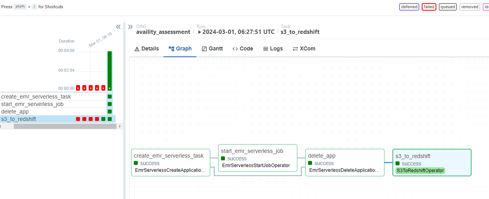
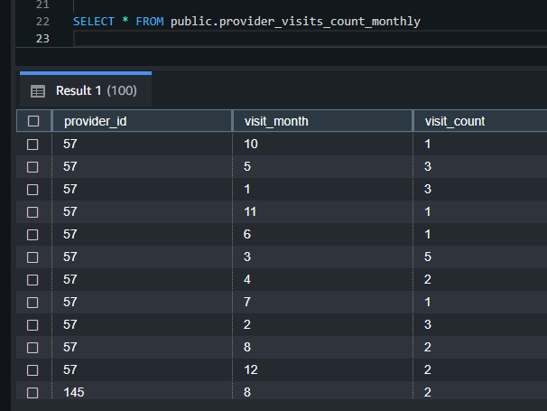

# Overview
This is the solution to the Availity Spark assessment.

This includes the requested code, along with the deployment of the Spark application and RedShift load to Airflow and EMR Serverless.

Unit test development is in progress.

# Index
- `src`
  - Contains Scala source code for the application.
- `airflow`
  - Contains the Airflow DAG to run the EMR Serverless job and COPY into RedShift.
- `.github/workflows`
  - Contains GitHub Actions config to run the build and deployment of the Spark application.

# Problem Solution
## Problem 1

### Problem Statement
Given the two data datasets, calculate the total number of visits per provider. The resulting set should contain the provider's ID, name, specialty, along with the number of visits. Output the report in json, partitioned by the provider's specialty.
### Deployment
Deployed to EMR Serverless with this code: 
- [.github/workflows/deploy_jar.yml](.github/workflows/deploy_jar.yml)
- [.github/workflows/deploy_airflow_dag.yml](.github/workflows/deploy_airflow_dag.yml)
GitHub Actions runs here: [https://github.com/kgmcquate/availity-assessment/actions](https://github.com/kgmcquate/availity-assessment/actions)

### S3 Data with Partitions

### JSON Data

## Problem 2
### Problem Statement
Given the two datasets, calculate the total number of visits per provider per month. The resulting set should contain the provider's ID, the month, and total number of visits. Output the result set in json.
### JSON File

### JSON Data

## Airflow
DAG code located here: [airflow/availity_assessment_dag.py](airflow/availity_assessment_dag.py)
### Airflow DAG run

### EMR Serverless job run

### RedShift Table after COPY

