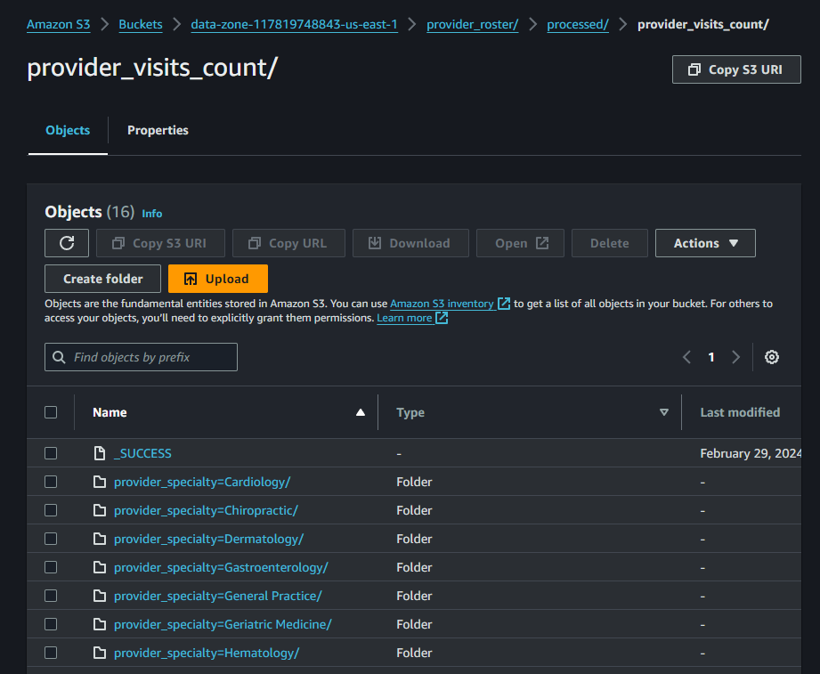
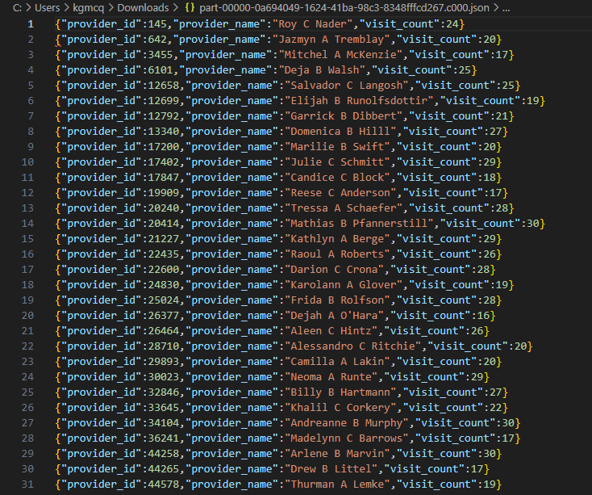
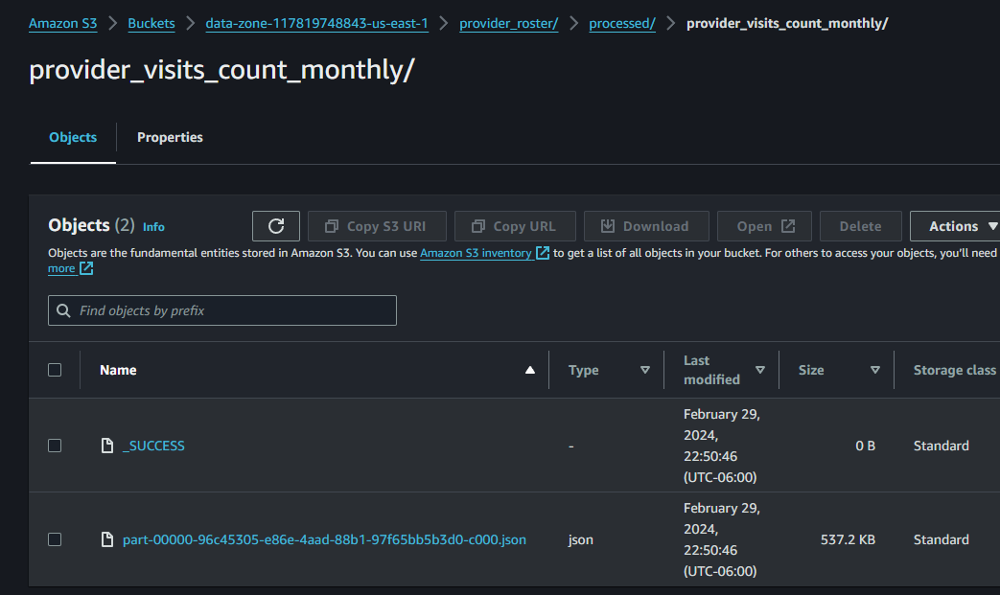
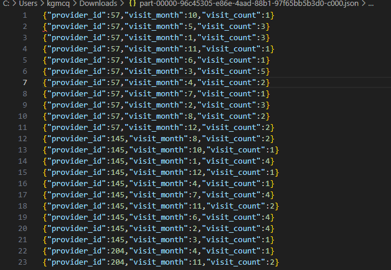
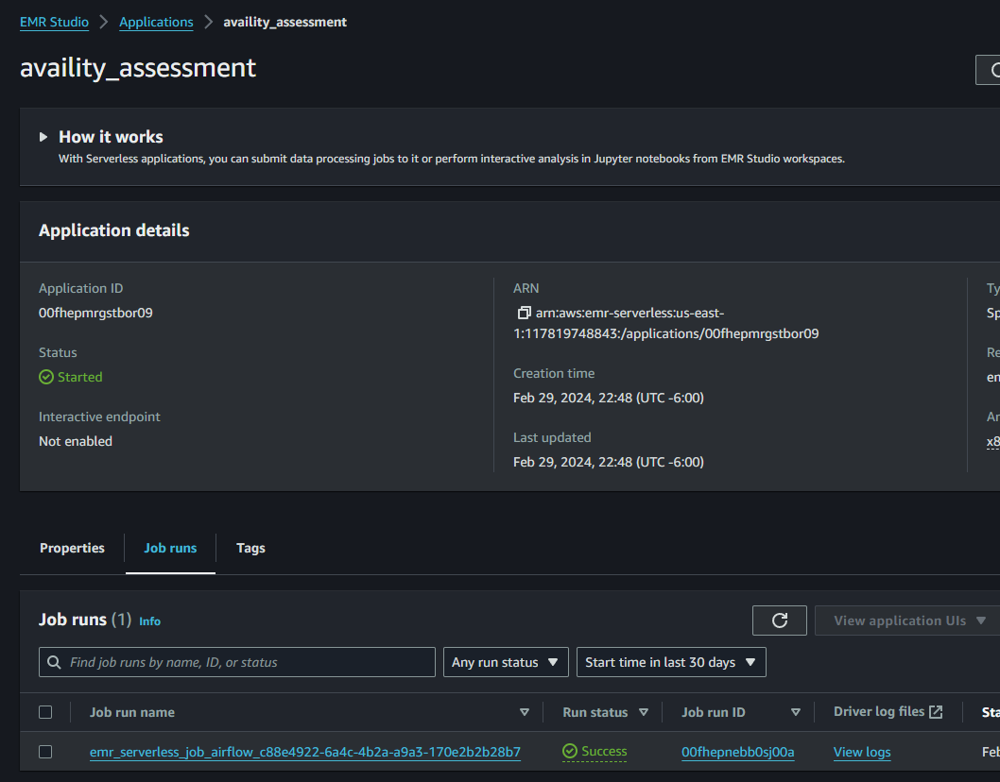

# Overview
This is the solution to the Availity Spark assessment.

This includes the code, as requested, along with the deployment of the Spark application to Airflow and EMR Serverless.

# Index
- `src`
  - Contains Scala source code for the application.
- `airflow`
  - Contains the Airflow DAG to run the EMR Serverless job.
- `.github/workflows`
  - Contains GitHub Actions config to run the build and deployment of the Spark application.

# Problem Solution
## Problem 1
### Problem Statement
Given the two data datasets, calculate the total number of visits per provider. The resulting set should contain the provider's ID, name, specialty, along with the number of visits. Output the report in json, partitioned by the provider's specialty.
### Partitions

### Data

## Problem 2
### Problem Statement
Given the two datasets, calculate the total number of visits per provider per month. The resulting set should contain the provider's ID, the month, and total number of visits. Output the result set in json.
### File

### Data

## Airflow
### Airflow DAG run

### EMR Serverless job run
